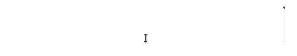
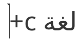
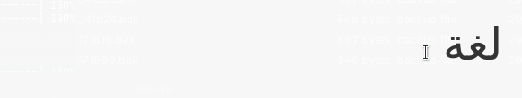
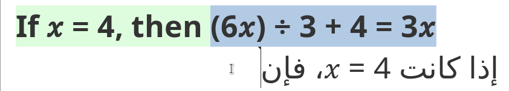
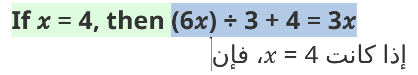

# Handling bidirectionality

## Text direction and text alignment 

By default, text direction in the translation editor is left to right (LTR) and text is aligned to the left. That applies to text in any language except languages written in a right-to-left (RTL) script, like Arabic, Hebrew, Syriac, etc., in which case the segment flows from right to left (RTL) and is aligned to the right.

Global text **direction** and **alignment** of source and target segments is determined by the source and target languages, respectively, indicated in the project settings. Depending on the language, segments are aligned either to the left or to the right. On the other hand, while text direction at the segment level is determined by the project settings, text direction might change inside the segment depending on the script used. For example, English text in a LTR segment will flow left to right but a quotation in Arabic in that same segment will flow right to left.

> Since OmegaT users are only responsible for producing the translation, let’s focus on what happens in target segments. Everything that follows applies to source segments too, with the difference that they are not directly editable in the translation editor in OmegaT.

## Bidirectionality mode

The bidirectionality mode activates either when at least one of the two languages in the project uses a RTL script or when some text in a RTL is inserted. When the bidirectionality mode is activated, text direction is indicated by a flag on the top of the cursor. In the image below, notice how by default the cursor flag points left in a RTL segment but it may point left or right depending on the previous character:

In text written in an LTR script, text flows from left to right, which means that the cursor flag points right and every character typed in LTR script always appears to the right of the previous one. That is always the case for the whole LTR segment unless it contains some fragment in an RTL script, in which case the rules for RTL text apply within that fragment. 

## Strong and weak directionality

In text written in an RTL script, text flows from right to left or left to right depending on the characters typed. Alphabetic characters have a RTL directionality: after each alphabetical character, the cursor flag points left, which means that if a new character is inserted, it will appear to the left of the cursor. On the other hand, numeric characters have a LTR directionality: after each number, the cursor flag points right, which means that if a new number is inserted, it will appear to the right of the cursor. Strings in LTR script will behave like numbers.

Letters and numbers have a strong directionality, which means that they always flow in the same direction: letters in RTL script flow from right to left, letters in LTR flow from left to right, and numbers in any script always flow from left to right too. However, other characters like punctuation symbols do not have an intrinsic directionality of their own and will inherit the directionality of the segment (hence called of weak or neutral directionality): one same character (e.g. +, as in the image above) will flow right to left in a RTL segment, whereas it will flow left to right in a LTR segment. 

## Orientation

Some characters, such as quotation marks, are purely bidirectional and may also have a different orientation depending on the directionality of the segment. For example, the opening double angle quotation mark (Unicode U+00AB) points left when used in a LTR segment, but the same character points right when used in a RTL segment. In the image below, an autotext entry is used to insert that character in an LTR segment:

In the image below, in turn, the same autotext entry is used to insert the same character in a LTR segment: 

The same thing would happen with any other double characters with neutral directionality, such as parenthesis, square brackets, curly brackets, etc. The opening character will point left or right depending on the directionality of the text stretch where it is inserted.

## Bidirectionality control characters 

Often the default behaviour described above is fine, but when you’re mixing RTL text and LTR text or using special characters with weak directionality in RTL, you might need to use Unicode bidirectionality control characters (or bidi characters for short) to achieve the expected directionality. Bidi control characters can be found in the menu **Edit > Insert Unicode Control Characters** and may be used to:

1. insert an invisible character with a certain strong directionality to force a specific position for a character with weak directionality
2. create an embedding which works as a sort of protective environment within which text can flow in the opposite direction of the segment.

These control characters are invisible, nothing is display or printed, but they change directionality. If you want to see where these characters are inserted, you can activate option **View > Mark Bidirectional Algorithm Control Characters**.

### Marks

Let’s see a few examples. Some expressions and brand names combine symbols with letters, e.g. Yahoo!, C++, C#, Hola!, Chips Ahoy!, etc. If you must write, say, “C++” in Arabic, you will notice that by default the + characters will appear to the left of the letter C:

That is obviously incorrect. To force the correct position of the ++ characters, type C, then ++, then insert a left-to-right mark (or LRM for short) at the end. The ++ part will then be surrounded by two characters with strong LTR directionality (namely, the letter C and the LRM) and therefore will inherit the directionality of those characters and flow left to right instead of inheriting the directionality of the segment and flow right to left. See that in action in the following image: 

You might be tempted to type characters in reverse order: first ++, then C. Even though that might look good, that is logically wrong and could bring about issues when the text is further processed later or subjected to different uses. For example, if you type ++C in Arabic, even if it looks visually correct in the translation editor, it will not appear in search results when a user looks for “C++” in the Arabic document. Let alone the fact that often, if the expression is a bit complex, you’ll struggle with trial and error until you obtain something that (only) looks as expected (although underneath it is wrong). Don’t try to fake the looks.

LRM and RLM (marks) characters are enough when you must change the directionality and position of one character only at the end or beginning of one homogeneous chunk of text. However, when the expression that must flow in the opposite direction contains several parts separated by spaces, or contains non-alphanumeric characters as well as alphanumeric characters, it’s often better to use RTL or LTR embeddings.

### Embeddings

The behaviour of embeddings is a bit different from that of marks. For starters, two characters must be inserted: one to start the embedding and another one to pop out of it. For example, to create a LTR embedding in an RTL segment, you would insert a left-to-right embedding (LRE) character, then the LTR text, then the pop directional formatting (PDF) character. Likewise, to create a RTL embedding in an LTR segment, you would insert a right-to-left embedding (RLE) character, then the RTL text, then the PDF character. 

Let’s see an example. Equations, formulas and mathematical notation in general are expressions that must normally run left-to-right in bidirectional languages like Arabic or Hebrew, just like in English. Simply typing or copy-pasting an equation in Arabic will not produce the correct result, as can be seen in the image below:

Instead, you should proceed in this way to create a LTR embedding: 

1. insert the LRE character, 
2. then type or insert the equation, 
3. finally insert the PDF character. 

See that in action:

Notice how the red square rim appears around the LTR embedding right after inserting the PDF character, when the option Mark Bidirectional Algorithm Control Characters is activated in the View menu.